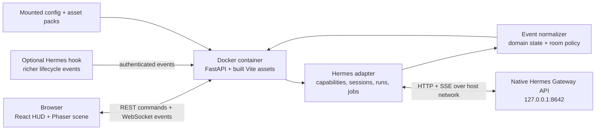

# Yume Dashboard Design

**Date:** 2026-07-27  
**Status:** Approved design  
**Product:** Ame-no-Uzume, a local visual dashboard for the Yume personal assistant

## Summary

Ame-no-Uzume visualizes a native Hermes Agent instance as a living pixel-art office. Yume is the permanent CEO. Scheduled jobs appear as persistent workers, while delegated subagents enter through the lobby, perform verified work, report, and leave. The entire product is one immersive isometric page with simulation-game borders and floating panels.

The dashboard is a visualizer and task interface, not a Hermes configuration tool, office editor, analytics suite, or general-purpose multi-session chat client.

## Viability

The project is viable with moderate integration risk.

Hermes already exposes the essential integration surfaces:

- A [capabilities endpoint](https://hermes-agent.nousresearch.com/docs/user-guide/features/api-server/) for runtime feature detection.
- Persistent session endpoints and an SSE chat stream with assistant deltas and tool lifecycle events.
- Runs endpoints for progress streaming, status polling, stopping, and approvals.
- Health, jobs, and session APIs for connection and persistent-worker state.
- Optional [event hooks](https://hermes-agent.nousresearch.com/docs/user-guide/features/hooks/) for richer subagent lifecycle telemetry.

The principal limitation is observability. Standard events reliably show that work is occurring but may not always expose a precise subagent identity or semantic activity. The design therefore uses verified-first hybrid behavior: display verified detail when present, then degrade only to generic states such as `working`. It never invents a specific tool, task, or result.

Phaser is suitable because it supports isometric Tiled maps, coordinate conversion, cameras, animation, and sprite interaction. Docker Desktop 4.34 or newer can use opt-in [host networking](https://docs.docker.com/engine/network/drivers/host/), allowing the container to reach Hermes while Hermes remains bound to `127.0.0.1`.

## Goals

- Provide one task-focused conversation with Yume.
- Make live Hermes activity understandable at a glance.
- Represent Yume, scheduled jobs, and delegated subagents with distinct lifecycles.
- Keep Hermes-specific payloads out of the renderer.
- Ship as one lightweight local container for macOS.
- Allow customization through configuration, Tiled maps, and replaceable asset packs.
- Keep the codebase suitable for an open-source project.

## Non-Goals

- Multiple conversations or session management.
- An office, character, or asset editor.
- Hermes configuration, skill, model, channel, memory, or cron management.
- Multi-user authentication or official network hosting.
- Official mobile, Linux, or Windows support in v1.
- Analytics, historical reporting, or a public plugin SDK.

## Architecture



React owns the top HUD, floating task chat, connection overlays, and sprite inspector. Phaser owns the isometric map, camera, pathfinding, sprites, animation, hit testing, and depth sorting. Both consume the same frontend world store.

FastAPI serves the production frontend, proxies commands, consumes Hermes SSE streams, normalizes events, maintains the current world snapshot, and broadcasts versioned events to the browser. The browser never calls Hermes directly and never receives its API key.

## Monorepo Layout

```text
ame-no-uzume/
├── apps/
│   ├── web/                 # React, Vite, Phaser
│   └── api/                 # FastAPI and Hermes adapter
├── packages/
│   └── contracts/           # Versioned JSON schemas/domain events
├── asset-packs/
│   └── default/             # Bundled map, sprites, UI, pack.json
├── config/
│   └── dashboard.example.yaml
├── integrations/
│   └── hermes-hook/         # Optional host-side observability bridge
├── tests/
│   └── e2e/
├── infra/
│   └── docker/
├── compose.yaml
├── Makefile
└── README.md
```

`apps/web` and `apps/api` do not import one another. Their shared boundary is the language-neutral contract in `packages/contracts`. Pydantic models are authoritative; the TypeScript client types are generated from their OpenAPI and JSON schemas.

## Deployment and Security

Production uses one multi-stage image: Node builds Vite, then a slim Python image serves the compiled files through FastAPI. Development may run Vite and FastAPI separately, but `make dev`, `make test`, `make lint`, and `make build` remain the root entry points.

V1 requires:

- macOS with Docker Desktop 4.34 or newer.
- Docker Desktop host networking enabled.
- Hermes Gateway API enabled and bound to `127.0.0.1`.
- A valid `HERMES_API_KEY` supplied to the container.

The dashboard binds to host loopback. Tailscale exposure is user-managed and outside the project. The container runs as a non-root user, does not mount the Docker socket or Hermes home, and mounts custom configuration and asset packs read-only. Hermes credentials and the optional hook token live only in environment secrets and are redacted from logs. Browser CORS access to Hermes stays disabled.

## Hermes Session Model

On first startup, the backend creates one Hermes session titled `Yume Dashboard` and stores only its session ID in the dashboard data volume. Subsequent starts retrieve its messages and continue it. A reset action closes that transcript and creates one replacement; there is never a session list.

Text tasks use `/api/sessions/{id}/chat/stream` when advertised by `/v1/capabilities`. If session streaming is unavailable, the adapter falls back to the Runs API and supplies the existing session transcript as conversation history. The chat shows streaming output, task progress, and final responses. Stop and approval actions appear only when the connected Hermes version advertises those capabilities. V1 accepts text only.

## Task Data Flow

1. React submits a text task to FastAPI for the active dashboard session.
2. FastAPI starts a Hermes session stream or compatibility run.
3. The adapter converts assistant deltas, tool progress, approval, delegation, and completion payloads into domain events.
4. The backend reducer updates its authoritative world snapshot and broadcasts ordered changes.
5. React updates the transcript and inspector state; Phaser receives only world commands such as spawn, move, animate, pause, and exit.
6. Completion or failure reconciles the run, transcript, and affected agents before Yume returns to idle.

## Domain Event Contract

Every event includes:

- `schema_version`
- `event_id`
- `sequence`
- `occurred_at`
- `source`
- `evidence`: `verified` or `inferred`
- `agent_id`, when applicable
- A typed payload

Core event types are:

- `connection.changed`
- `snapshot.replaced`
- `conversation.delta`
- `conversation.completed`
- `agent.spawned`
- `agent.state_changed`
- `agent.task_changed`
- `approval.requested`
- `approval.resolved`
- `run.finished`

Raw Hermes payloads terminate at the adapter. Unknown fields are ignored. Unknown domain event versions are logged and ignored, followed by snapshot reconciliation.

Evidence priority is:

1. Optional hook events.
2. Session or Runs stream events.
3. Jobs and health APIs.
4. Generic inferred activity.

## Agent Lifecycles

Yume is always present:

```text
idle at CEO desk → thinking → working or supervising → idle
```

Scheduled workers are stable identities derived from Hermes job IDs:

```text
idle at automation → move to room → working → return to automation
```

Delegated workers are ephemeral identities derived from the active run and child/tool call:

```text
spawn at lobby → move to room → working → report → return to lobby → despawn
```

If Hermes exposes only a `delegate_task` tool call, the dashboard may show a verified generic delegated worker. It must not invent a role or name. Failures display a clear failed state before the worker exits. Approval waits pause the relevant sprite and show a contextual marker.

## Office and Room Policy

V1 ships one balanced six-zone isometric office:

| Zone | Default activity |
| --- | --- |
| CEO office | Yume idle, thinking, and supervising |
| Memory vault | Memory recall, save, and context operations |
| Research library | Web, browser, retrieval, and research tools |
| Work floor | Terminal, files, code, and unknown tools |
| Automation | Persistent scheduled workers and cron activity |
| Lobby | Delegated worker entrance and exit |

Mapping rules are ordered from exact tool name, to configured pattern/category, to the work-floor fallback. A new Hermes tool therefore produces safe generic behavior until configuration adds a more specific mapping.

## Interface Behavior

The map fills the viewport inside a pixel-art game border. A thin HUD displays Hermes connection state, current Yume activity, and active agent count.

The lower-right task panel is movable, resizable within fixed bounds, collapsible, and locally remembers its presentation. It contains the single session transcript, input, streaming state, and contextual stop or approval controls.

Clicking a sprite opens one floating inspector containing:

- Display name and agent kind.
- Verified task summary, or a generic state.
- Current status and room.
- Evidence level.
- Elapsed activity time.
- Next scheduled run for persistent workers, when available.

Clicking empty space closes the inspector. The camera fits the office by default and supports drag-to-pan, discrete zoom, and reset. Phaser uses nearest-neighbor filtering and integer asset scaling; movement may interpolate in world space, but rendered sprite positions snap to whole pixels. There are no routes, tabs, sidebars, settings pages, or pagination.

## Configuration and Asset Packs

`config/dashboard.yaml` selects the active pack and contains non-secret display settings, semantic-zone mappings, tool-pattern rules, sprite assignments, and animation timing.

Each asset pack contains a versioned `pack.json` describing:

- Tile and sprite dimensions.
- Tiled JSON map and tileset paths.
- Sprite atlas paths and named animations.
- Required semantic zones and navigation anchors.
- Default Yume, scheduled-worker, and delegated-worker sprites.

Users may replace images while preserving the declared dimensions, or edit the manifest and Tiled map for deeper customization. Changes require a container restart in v1. Asset packs contain data and artwork only, never executable frontend code.

FastAPI validates manifests, files, atlas frames, animation names, semantic zones, navigation anchors, and map reachability before enabling the live scene. Validation failure serves a diagnostic overlay naming the exact file and error. The repository ships with a complete redistributable starter pack and performs no runtime asset downloads.

## Asset Production Workflow

Asset production has two deliberate stages.

### Functional Placeholder Pack

Implementation begins with a complete placeholder pack using 64×32 isometric tiles and 32×48 character canvases. It includes every required semantic zone, navigation anchor, sprite role, and animation tag, even when the artwork is only colored geometry. Placeholder assets are production-shaped rather than temporary one-off files: they use the final manifest, atlas, naming, anchor, and export contracts.

The placeholder pack exists to validate:

- Isometric projection, depth sorting, and whole-pixel rendering.
- Pathfinding through all six rooms.
- Sprite entrance, movement, work, report, failure, and exit sequences.
- UI overlap, camera limits, and inspector targeting.
- The actual frame, direction, prop, and set-piece requirements.

### AI-Assisted Production Pack

After the simulation behavior is stable, the project freezes its style bible and required animation list. AI-generated images provide character directions, room mood studies, furniture references, palette exploration, and candidate source designs. Generated output is reference material, not an unchecked runtime atlas.

The maintainer performs the final Aseprite pass: pixel cleanup, palette normalization, silhouette consistency, transparent-edge cleanup, directional alignment, animation, frame timing, and anchor placement. Development assistance includes prompt design, style-bible maintenance, frame planning, palette review, asset QA, manifest updates, export automation, and in-engine verification.

The editable and runtime files remain together:

```text
asset-packs/default/
├── sources/
│   ├── characters/*.aseprite
│   ├── office-tiles.aseprite
│   └── office.tmj
├── atlases/*.png
├── atlases/*.json
├── maps/office.json
└── pack.json
```

Aseprite tags define named animations and export PNG atlases with JSON metadata. Tiled owns the editable isometric office map. Replacing the placeholder pack with the production pack must require no application-code changes. The public v1 release includes the cleaned production pack; the placeholder pack remains available for tests and contributor development.

## Optional Observability Bridge

`integrations/hermes-hook` is an optional host-side Hermes integration. It publishes authenticated, deduplicated lifecycle events to a loopback FastAPI endpoint, including richer subagent start/stop information when Hermes provides it.

The dashboard remains functional without the bridge. The UI exposes telemetry mode as `standard` or `enhanced`; it does not treat standard mode as an error.

## Resilience

- Hermes starts in `starting`, then becomes `connected`, `degraded`, or `disconnected`.
- On disconnect, the office remains visible, active sprites become stale and pause, task submission disables, and the backend retries with bounded exponential backoff.
- SSE interruption falls back to run-status polling where available, then requests a new world snapshot.
- Snapshot replacement is authoritative and idempotent.
- Malformed events are logged and skipped without terminating the stream or Phaser scene.
- Backend restart restores the session ID, messages, jobs, and connection status. It does not recreate unverified active subagents.
- Missing optional capabilities hide their associated controls.

## Testing and Release Validation

- Pytest covers adapters, capability negotiation, event normalization, lifecycle reducers, reconnection, session restoration, and schema validation.
- Vitest covers frontend stores, room policy, world-command generation, and floating-panel behavior.
- Phaser logic is kept behind pure state and command boundaries so most movement decisions can be tested without a GPU.
- Playwright drives the full page against a deterministic fake Hermes server, including streaming, delegation, jobs, approval, failure, disconnect, and recovery fixtures.
- Asset validation runs through committed local commands.
- Before v1 is complete, all linting, type checks, tests, builds, end-to-end coverage, and Docker validation run locally; the repository contains no CI/CD workflows.
- Every release receives a manual macOS Docker Desktop host-network smoke test.

## Repository Delivery Policy

The GitHub remote is `https://github.com/nakanokazuha/ame-no-uzume.git`, with implementation performed directly on `main`. A plan task—not an individual step—is the delivery unit: finish its verification, create its focused commit, and push `main` before beginning the next task. CI/CD design and GitHub Actions are explicitly deferred until the full v1 acceptance gate passes.

## V1 Acceptance Criteria

V1 is complete when:

1. After completing the documented Hermes and Docker Desktop prerequisites, a macOS user can start the dashboard with one Docker command.
2. The dashboard reconnects to one persistent Yume session and can submit text tasks.
3. Yume visibly transitions through idle, thinking, working, approval, completion, and failure states supported by evidence.
4. Scheduled jobs appear as persistent automation workers.
5. A verified delegation creates an ephemeral worker that enters, works, reports, and exits.
6. Sprite inspection shows accurate task and evidence information.
7. Disconnect and restart behavior reconcile without invented agent activity.
8. A user can select a compatible third-party asset pack through configuration without changing application code.
9. The cleaned production pack replaces the placeholder pack without changing application code.
10. The full automated suite and macOS release smoke test pass.

## Principal Risks

| Risk | Mitigation |
| --- | --- |
| Hermes event shapes evolve | Capability negotiation, fixture-based adapters, and versioned domain events |
| Standard telemetry lacks detail | Generic verified states plus the optional observability bridge |
| Isometric art becomes the schedule bottleneck | Small six-zone starter pack and strict asset manifest |
| Phaser state couples to React | Shared event store and world-command boundary |
| Docker networking exposes Hermes | Host networking with loopback bindings; no bridge-mode default |
| Custom packs break navigation | Startup validation of anchors and reachability |
